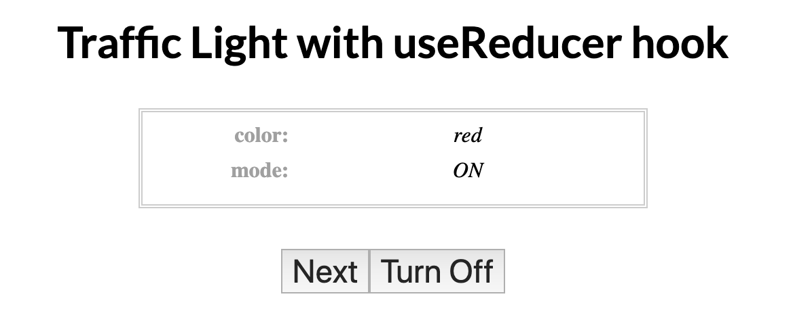

# Traffic Light Lab for React `useReducer` Hook

## Instructions

Make a React app that uses the `useReducer` hook to simulates a traffic light. There should be two buttons

* a *Next* button that advances the traffic light to the next color. The state transitions are: `red --> green --> yellow --> red`

* A toggle button that turns the light on and off. If the light is off, the *Next* button should be disabled.

Your app should look something like this:

---

